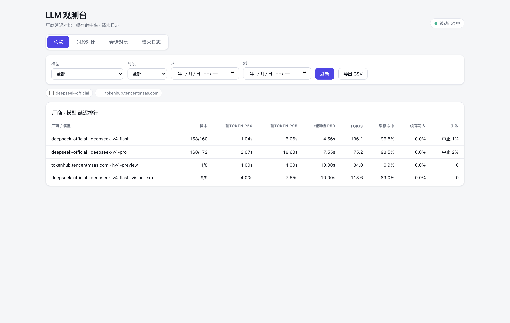
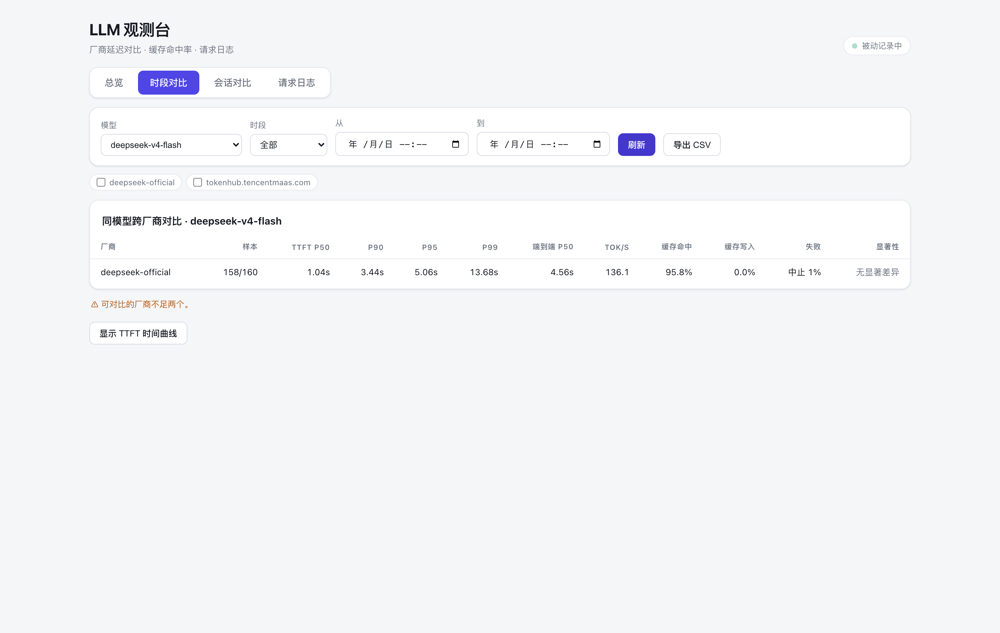
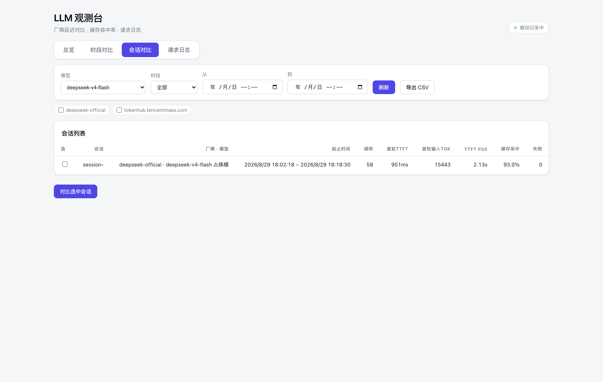
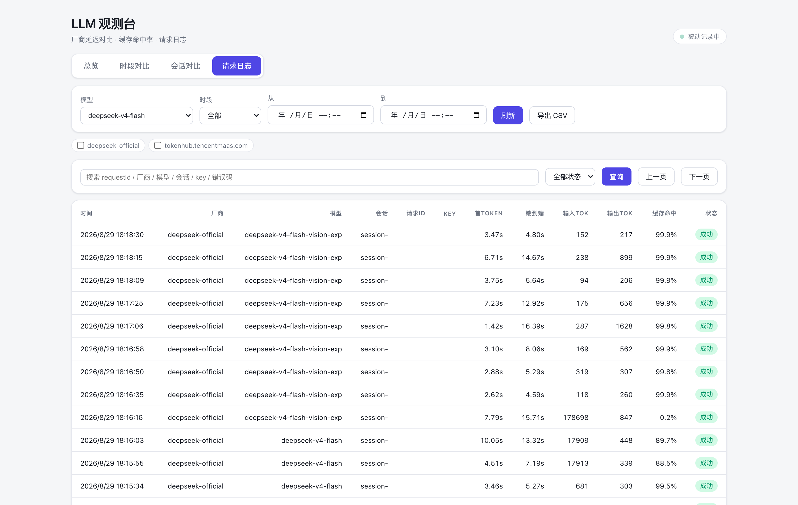

# dsh-llm-latency

[English](README.md) · [中文](README.zh.md)

面向 DeepSeek Harness 的「按厂商 / 模型 / 会话」LLM 延迟与缓存命中统计插件。用数据回答一个问题：**同一模型、同一时段，到底是哪家厂商更快、缓存命中率更高？**

- **被动埋点**——每一次真实模型调用都被测量（首 token、端到端、吐字速率、缓存命中率），并按失败类型（429 / 超时 / 5xx / 中止）分类。
- **三类对比**：
  1. **总览**——任意时段内按厂商 · 模型排行。
  2. **时段对比**——同一模型跨厂商，在任选时间窗（如「今天 10:00–10:30」）输出 P50/P90/P95/P99、失败率、缓存命中率、样本量与显著性。
  3. **会话对比**——两个会话发相同提示词、各锁一个厂商的同一模型，跑完后对比整段；前提是会话内未切换模型。
- **仪表盘 + 工具**——自包含 HTML 仪表盘（总览 / 时段对比 / 会话对比 / 请求日志 四个视图），加上 `latency_report` 模型工具，支持导出 CSV。
- **请求日志**——每次模型调用落一条记录（时间、厂商、模型、会话、请求 ID、key、首 token、端到端、输入输出 token、缓存命中率、状态），可在网页上搜索/过滤。

数据模型与对比方法论见 [DESIGN.md](DESIGN.md)。

## 截图

**总览**——任意时段内按厂商 · 模型排行。



**时段对比**——同一模型跨厂商，含 P50/P90/P95/P99、失败率、缓存命中率与显著性。



**会话对比**——两个单模型会话并排对比。



**请求日志**——搜索/过滤每次模型调用。



## 安装

```sh
dsh plugin --profile web add github:<你>/dsh-llm-latency
```

安装后重启 profile。插件在 `dsh-base` 之后生效（依赖 `llm` 服务），拦截 `llm/stream`，并把仪表盘挂在：

```
http://127.0.0.1:<端口>/llm-latency/
```

## 使用

- **仪表盘**——在 总览 / 时段对比 / 会话对比 / 请求日志 四个视图间切换：
  - 时段对比：选一个模型、选一个时段，跨厂商并排对比。
  - 会话对比：勾选两个「会话内单模型」的会话进行对比。
  - 请求日志：按请求 ID、厂商、模型、会话、key、状态搜索/过滤每次调用。
- **模型工具**——对 agent 说「帮我看看各厂商延迟对比」（`latency_report`），支持 `model`、`vendors`、`from`/`to`、`sessionIds` 参数。

## 数据存储位置

聚合结果持久化在 `$DSH_HOME/llm-latency/stats.json`（默认 `~/.dsh/llm-latency/stats.json`）。删除该文件即可清零。请求日志以追加方式存于 `$DSH_HOME/llm-latency/requests.jsonl`。

## 指标定义

- **TTFT**（主）：到首个内容 chunk 的毫秒数；**e2e**：到流结束；**tok/s**：解码吞吐。
- **缓存命中率**：`cacheRead / (input + cacheRead + cacheWrite)`；**缓存写入率**：`cacheWrite / 同分母`。
- **失败分解**：429（限流）、超时、5xx、中止、其他，各自占尝试数比例。重试是独立 `llm/stream`，429 按「尝试」计。

## 对比方法论

同模型跨厂商对比总是把双方切到**同一时段**。分位数来自合并直方图；中位数 95% bootstrap 置信区间在窗口样本足够（`minSamplesForComparison`）时来自 recent 样本环。两厂商中位数 CI 不重叠 → 差异显著。样本不足、样本量悬殊会显式告警。

## 配置

在 `cordis.patch.yml` 中设置（或覆盖对应行）：

| 键 | 默认值 | 含义 |
| --- | --- | --- |
| `retentionDays` | `30` | 数据保留天数 |
| `recentLimit` | `2000` | 每 key 精确样本环上限 |
| `sessionLimit` | `500` | 保留的会话数上限 |
| `spikeFloorMs` | `10000` | 毛刺阈值 |
| `modelAliases` | `{}` | canonical 模型 → 各厂商 model id |
| `minSamplesForComparison` | `20` | 显著性所需最少成功样本 |
| `logLimit` | `5000` | 请求日志保留的最近记录数 |
| `logRetentionDays` | `7` | 请求日志保留天数 |

## 实现原理

插件在 `llm/stream` 上注册 waterfall 监听器，包装返回的 `AsyncIterable<StreamChunk>`，在**首次拉取**时起表——那一刻正是适配器惰性发起 HTTP 请求的时机。失败携带 harness 的 `LlmFailure.code/status`，映射为上述五类。

## License

MIT
