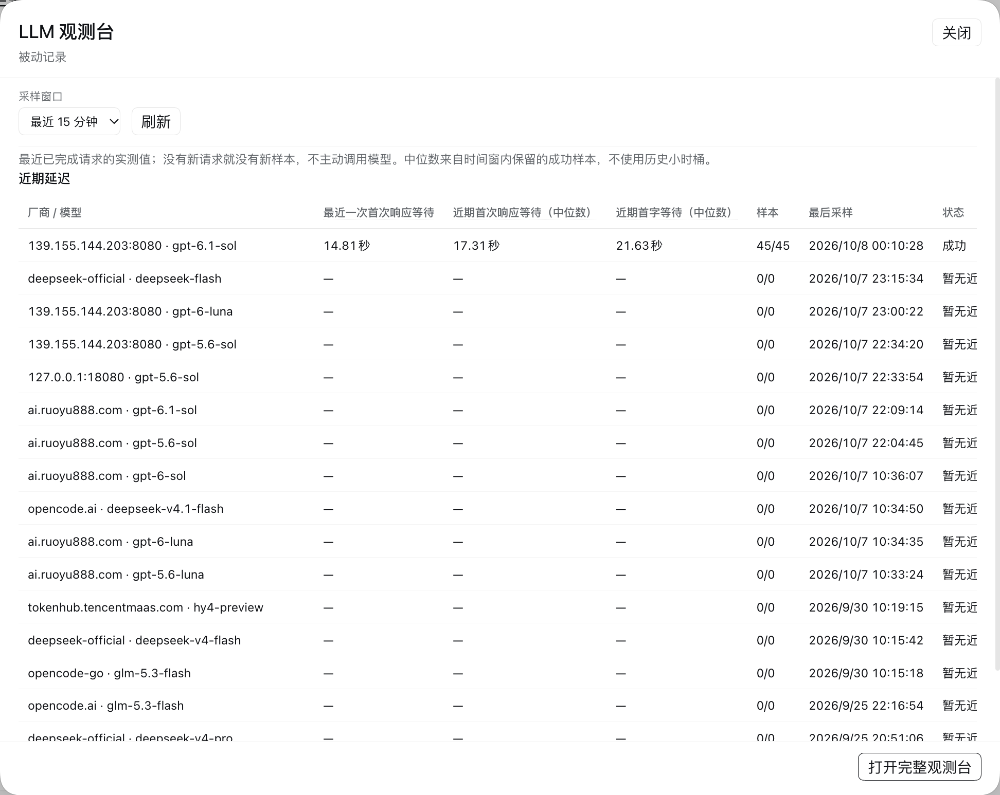
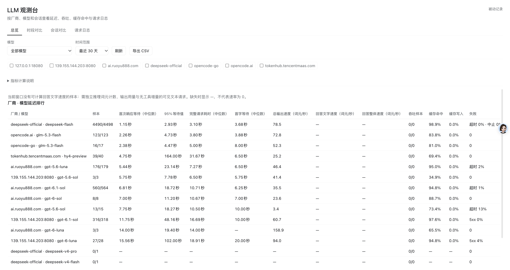

# dsh-llm-latency

[English](README.md) · [中文](README.zh.md)

DeepSeek Harness 的被动延迟观测插件。查看模型多久开始响应、对比不同厂商，并检查单次请求，不额外发起模型调用。

## v0.2.0 提供什么

- **原生观测台：**点击 DSH 侧边栏的「LLM 观测台」，打开总览、时段对比、会话对比和请求日志，读取已有统计。
- **输入框速览：**点击「观测」，查看最近 15 分钟、1 小时或 3 小时的延迟，包括最近一次首次响应等待、近期首次响应与首字等待中位数、成功 / 总样本数和最后采样时间。
- **明确数据新鲜度：**没有新请求的模型显示「暂无近期样本」，不会把历史均值当成当前延迟，也不会主动探测未使用的模型。
- **指标解释：**悬停或键盘聚焦延迟、总输出速度表头，查看计时与样本规则。原生界面跟随 DSH 主题和语言，中文指标名称采用中文。
- **恢复旧版速度：**总输出速度与严格的回答文字速度、回答整体速度分列。缺少推理计数时，不会隐藏旧版数值，也不会把缺失的回答速度当成 0。
- **保留现有接口：**独立页面 `/llm-latency/`、JSON 接口、`latency_report` 工具、已有统计和 CSV 导出继续可用。

## 截图

**近期速览**——仅使用已完成请求，显示最后采样时间及暂无近期样本的状态。



**原生观测台**——总输出与回答文字速度分列，悬停说明解释指标的实际含义。



## 安装或更新

已在 DeepSeek Harness **0.2.1-alpha.1**、Node.js 22 和 Web profile 下验证。Harness 扩展接口尚未稳定，不保证其他版本兼容。

从 GitHub 安装固定版本：

```sh
dsh plugin --profile web add 'github:shengbinxu/dsh-llm-latency#v0.2.0'
```

也可以从 [GitHub Releases](https://github.com/shengbinxu/dsh-llm-latency/releases/tag/v0.2.0) 下载 `.tgz`，再安装该文件：

```sh
dsh plugin --profile web add ./dsh-llm-latency-0.2.0.tgz
```

安装后刷新 GUI；若激活结果要求重启，通过现有服务管理方式重启 DSH。发布包包含构建后的 Host 文件及浏览器入口，安装时无需构建。

## 如何使用

| 入口 | 展示内容 |
| --- | --- |
| DSH 侧边栏 →「LLM 观测台」 | 完整四视图和 CSV 导出 |
| 对话输入框 →「观测」 | 使用精确保留样本计算的近期延迟 |
| `http://127.0.0.1:3080/llm-latency/` | 保留的独立页面；地址以你的服务配置为准 |
| `latency_report` 工具 | 已记录的厂商 / 模型或会话对比 |

速览打开时每 10 秒刷新，关闭后停止。关闭按钮、Escape 和点击外部均可关闭；「打开完整观测台」切换至原生页面，不改变选中的会话。

近期窗口使用请求发起时间和精确保留样本；只有成功且记录了该项指标的请求参与中位数计算，首次响应与首字指标的有效样本可能不同。样本环容量可能减少保留数量。「暂无近期样本」表示本机缺少新测量，不表示模型不可用。

完整观测台默认显示最近 30 天。总览与跨厂商对比支持模型、厂商和时间筛选；会话对比统计完整会话，应选择未换模型、提示词相近的会话。请求日志支持搜索、状态、模型、时间及单个选中厂商筛选。历史分位数使用与窗口重叠的整小时桶，边界小时可能包含窗口外请求。

## 指标是什么意思

| 指标 | 计算方法 |
| --- | --- |
| 首次响应等待 | 首次拉取模型流 → 首段非空文字、推理内容或工具调用增量 |
| 首字等待 | 首次拉取模型流 → 首段非空回答文字；推理和工具调用不算回答文字 |
| 完整请求耗时 | 首次拉取模型流 → 模型流结束，不包含本轮其他工具执行 |
| 中位数 | 有效样本排序后的中间值；历史页面是直方图估计，速览是精确值 |
| 95%等待值 | 约 95% 的成功有效样本不超过该值 |
| 总输出速度 | 旧版累计总输出词元 ÷ 成功请求从首次内容到结束的累计耗时 |
| 回答文字速度 | 有效可见词元 ÷ 首段至末段非空回答文字的耗时（秒） |
| 回答整体速度 | 有效可见词元 ÷ 完整模型流耗时（秒），含首次等待 |
| 吞吐样本 | 回答文字 / 回答整体速度分别对应的有效样本数 |
| 缓存命中 / 写入 | 缓存读取 / 写入词元 ÷ 未缓存输入、缓存读取和缓存写入词元之和 |

计时从首次拉取适配器开始，通常此时才发起请求，不是从点击发送开始。首次响应可能只有推理或工具调用，早于答案文字；计时不包含浏览器渲染时间。

**为什么回答速度可能是 `—`：**可见词元需要输出用量、独立推理计数（明确为 0 也有效）、可见文字、成功状态且没有工具调用增量。缺失不是 0，只有一段文字时只能计算回答整体速度。已验证的 Harness pi-ai 适配器把推理合入总输出，却没有传出独立计数，因此这两项严格速度暂不可用；插件不按字符估算，也不把缺失推理计数当成 0。

**旧版总输出速度的限制：**分子可能包含推理、工具及失败请求已报告的输出，旧版分母只包含成功请求的首次内容至结束耗时，因此失败较多时可能偏高。该值为兼容旧版而保留，独立展示，不当作纯回答文字速度。JSON 和 CSV 保留 `tokensPerSecond` 表示旧指标，`outputTokensPerSecond` / `overallTokensPerSecond` 表示严格回答速度。

延迟也受提示词长度、推理设置、网络与工具调用影响。本机样本不等于厂商全局负载；跨厂商置信区间只针对首次响应等待，不针对输出速度。

## 数据与配置

聚合结果存于 `$DSH_HOME/llm-latency/stats.json`，单次记录存于 `$DSH_HOME/llm-latency/requests.jsonl`（默认 `~/.dsh`）。压缩、标题等辅助调用仅进入请求日志，不进入排行或近期速览。升级保留旧延迟与缓存数据；缺少新字段的旧样本不计入回答速度有效样本。

通过 bundle patch 或 profile 覆盖配置 `llm-latency` 行：

| 配置项 | 默认值 | 含义 |
| --- | --- | --- |
| `retentionDays` | `30` | 历史聚合保留天数 |
| `recentLimit` | `2000` | 每个厂商 / 提供方 / 模型的精确样本环容量 |
| `sessionLimit` | `500` | 保留会话数 |
| `spikeFloorMs` | `10000` | 首次响应等待的毛刺阈值 |
| `modelAliases` | `{}` | 标准模型名 → 各提供方的模型编号 |
| `minSamplesForComparison` | `20` | 中位数置信区间所需最少成功样本 |
| `logLimit` | `5000` | 请求日志内存容量 |
| `logRetentionDays` | `7` | 请求日志保留天数 |
| `statsPath` / `logPath` | 默认数据路径 | 可选的持久化路径覆盖 |

## 开发

```sh
npm ci
npm run typecheck
npm run build
npm test
```

源码改动时一并提交 `lib/`，GitHub 安装使用这些构建后的 Host 文件。浏览器入口是通过 Harness 模块表加载的自包含 JavaScript，不需要新增打包器或单独安装 React。

Host 包装 `llm/stream` 并提供只读 JSON。原生界面注册至 `main`、`sidebar.panellist`、`conversation.input.left` 和 `shell.overlay`，两种浏览器界面读取同一份 Host 数据。Cordis effect 负责释放路由及监听器。原始数据和对比设计见 [DESIGN.md](DESIGN.md)。

## License

MIT
